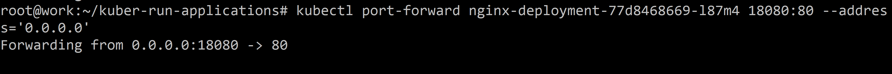
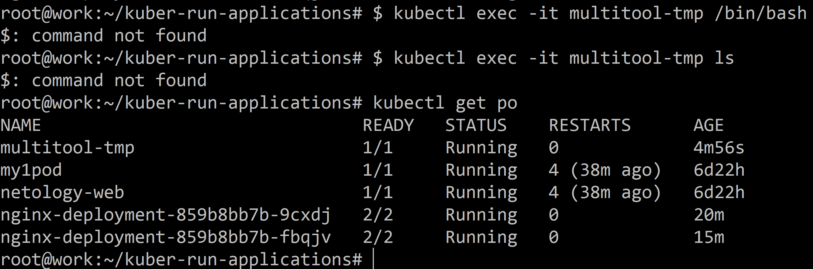
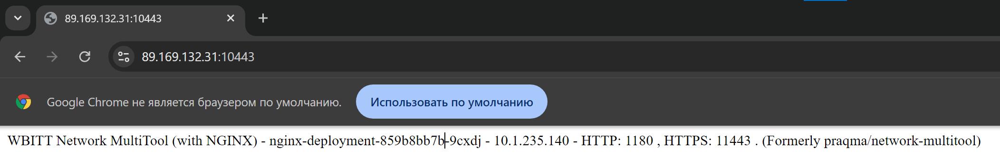
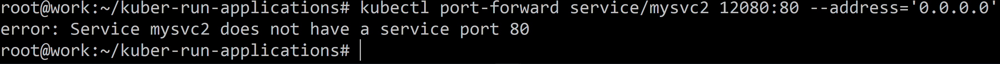
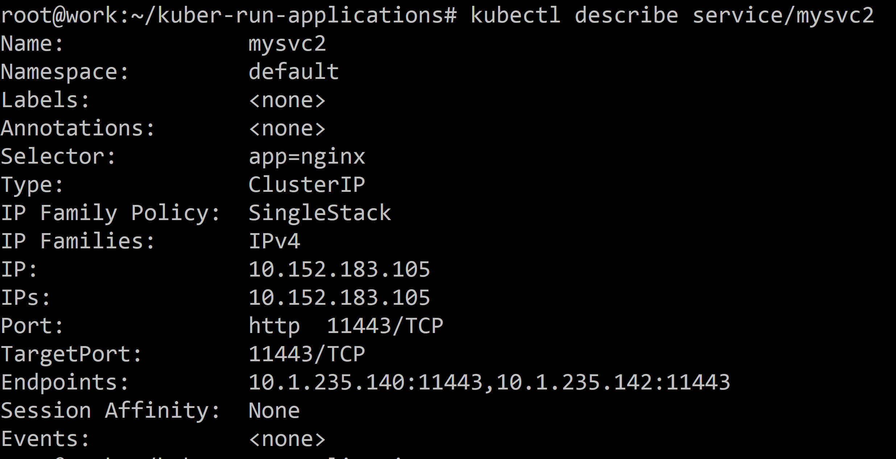
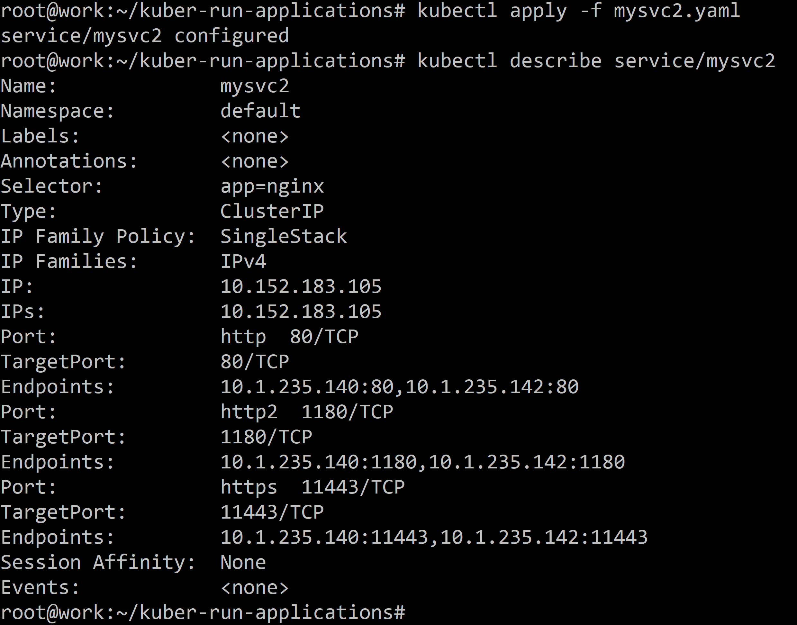
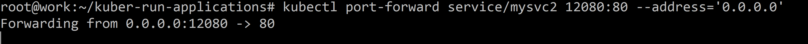
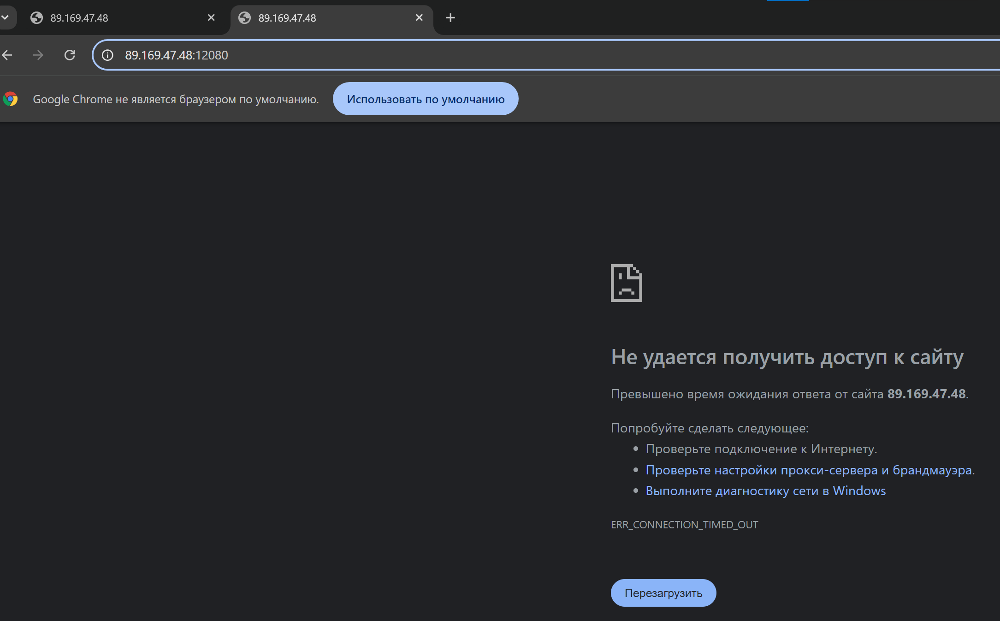

# Домашнее задание к занятию «Запуск приложений в K8S» - Илларионов Дмитрий

### Цель задания

В тестовой среде для работы с Kubernetes, установленной в предыдущем ДЗ, необходимо развернуть Deployment с приложением, состоящим из нескольких контейнеров, и масштабировать его.

------

### Чеклист готовности к домашнему заданию

1. Установленное k8s-решение (например, MicroK8S).
2. Установленный локальный kubectl.
3. Редактор YAML-файлов с подключённым git-репозиторием.

------

### Инструменты и дополнительные материалы, которые пригодятся для выполнения задания

1. [Описание](https://kubernetes.io/docs/concepts/workloads/controllers/deployment/) Deployment и примеры манифестов.
2. [Описание](https://kubernetes.io/docs/concepts/workloads/pods/init-containers/) Init-контейнеров.
3. [Описание](https://github.com/wbitt/Network-MultiTool) Multitool.

------

### Задание 1. Создать Deployment и обеспечить доступ к репликам приложения из другого Pod

1. Создать Deployment приложения, состоящего из двух контейнеров — nginx и multitool. Решить возникшую ошибку.

Для начала создал под с одним контейнером:


```
apiVersion: apps/v1
kind: Deployment
metadata:
  name: nginx-deployment
  labels:
    app: nginx
spec:
  replicas: 2
  selector:
    matchLabels:
      app: nginx
  template:
    metadata:
      labels:
        app: nginx
    spec:
      containers:
      - name: nginx
        image: nginx:1.14.2
        ports:
        - containerPort: 80
```

Проверил работу:

```
kubectl apply -f mydeployment.yaml
```


Временный проброс портов:

```
kubectl port-forward nginx-deployment-77d8468669-l87m4 18080:80 --address='0.0.0.0'
```



nginx работает.

Пока удалил деплоймент:

```
kubectl delete -f mydeployment.yaml
```


Теперь создаю второй контейнер (в дополнение к первому):


```
apiVersion: apps/v1
kind: Deployment
metadata:
  name: nginx-deployment
  labels:
    app: nginx
spec:
  replicas: 1
  selector:
    matchLabels:
      app: nginx
  template:
    metadata:
      labels:
        app: nginx
    spec:
      containers:
      - name: nginx
        image: nginx:1.14.2
        ports:
        - containerPort: 80
      - name: multitool
        image: wbitt/network-multitool
        env:
        - name: HTTP_PORT
          value: "1180"
        - name: HTTPS_PORT
          value: "11443"
        ports:
        - containerPort: 1180
          name: http-port
        - containerPort: 11443
          name: https-port
```
Запустил:


2. После запуска увеличить количество реплик работающего приложения до 2.

Увеличил и применил:


3. Продемонстрировать количество подов до и после масштабирования.
- продемонстрировал выше.

4. Создать Service, который обеспечит доступ до реплик приложений из п.1.

Создал сервис:

```
apiVersion: v1
kind: Service
metadata:
  name: mysvc2
spec:
  selector:
    app: nginx
  ports:
    - name: http
      protocol: TCP
      port: 80
      targetPort: 80
      port: 1180
      targetPort: 1180
      port: 11443
      targetPort: 11443
```


5. Создать отдельный Pod с приложением multitool и убедиться с помощью `curl`, что из пода есть доступ до приложений из п.1.

Создал отдеьлный под:

```
apiVersion: v1
kind: Pod
metadata:
  name: multitool-tmp
spec:
  containers:
  - name: multitool-tmp
    image: wbitt/network-multitool
    env:
    - name: HTTP_PORT
      value: "1180"
    - name: HTTPS_PORT
      value: "11443"
    ports:
    - containerPort: 1180
      name: http-port
    - containerPort: 11443
      name: https-port
```


Но, почему-то не получается подключиться внутрь пода:



Почему?

Тогда пробую проброс портов пока сделать для проверки доступа к мультитулу по https:

```
kubectl port-forward service/mysvc2 10443:11443 --address='0.0.0.0'
Forwarding from 0.0.0.0:10443 -> 11443
```
Проверил:


Теперь к nginx проверю:

```
kubectl port-forward service/mysvc2 12080:80 --address='0.0.0.0'
```

Но, почему то не заработало:



при этом:



Т.е. почему то не применились другие порты.

Пробую переделать сервис:



Теперь порты появились.


Опять пробую проброс портов на 80 на nginx.



Но, не работает:




Еще попробовал:

```
 kubectl port-forward service/mysvc2 12080:1180 --address='0.0.0.0'
Forwarding from 0.0.0.0:12080 -> 1180
```
Тоже не работает.

Пробую опять https

```
kubectl port-forward service/mysvc2 10443:11443 --address='0.0.0.0'
Forwarding from 0.0.0.0:10443 -> 11443
```
Но, то же не работает.

Видимо что-то не так в сервисе.
?

------

### Задание 2. Создать Deployment и обеспечить старт основного контейнера при выполнении условий

1. Создать Deployment приложения nginx и обеспечить старт контейнера только после того, как будет запущен сервис этого приложения.
2. Убедиться, что nginx не стартует. В качестве Init-контейнера взять busybox.
3. Создать и запустить Service. Убедиться, что Init запустился.
4. Продемонстрировать состояние пода до и после запуска сервиса.

------

### Правила приема работы

1. Домашняя работа оформляется в своем Git-репозитории в файле README.md. Выполненное домашнее задание пришлите ссылкой на .md-файл в вашем репозитории.
2. Файл README.md должен содержать скриншоты вывода необходимых команд `kubectl` и скриншоты результатов.
3. Репозиторий должен содержать файлы манифестов и ссылки на них в файле README.md.

------
